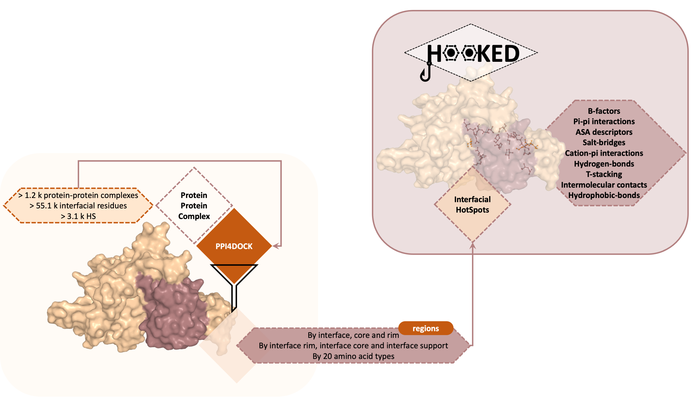

```{r setup, include=FALSE, warning = FALSE, error = FALSE}
knitr::opts_chunk$set(echo = TRUE)
```

```{r preparation,warning = FALSE, error = FALSE, message=FALSE}
library(tidyverse)
library(extrafont)
library(showtext)
library(eulerr)
library(ggpubr)
library(ggsci)
library(rmarkdown)
library(hrbrthemes)
library(DT)
library(cowplot)
library(ggplot2)
library(tiff)
library(grid)
library(downloadthis)
library(scales)

loadfonts(device = "postscript", quiet = TRUE)
showtext_auto()

tie_adjustment <- function(ranks) {
  Table <- table(ranks)
  N <- length(ranks)
  return((N + 1) + sum((Table ^ 3 - Table) / (N * (N - 1))))
}

grouped_mann_whitney_test <- function(DataFrame,group_var,value_var,sample_var) {
  subset_df <- DataFrame %>% 
    select(group_var,value_var,sample_var)
  colnames(subset_df) <- c("group","x","sample")
  Ns <- subset_df %>%
    group_by(group,sample) %>%
    summarise(n = length(x)) %>% 
    spread(sample,n)
  Ns_renamed <- Ns
  colnames(Ns_renamed) <- c("group",seq(1,ncol(Ns_renamed)-1))
  mannwhit_sum_of_ranks <- subset_df %>%
    group_by(group) %>%
    mutate(ranks = rank(x)) %>%
    group_by(group,sample) 
  n_ties <- mannwhit_sum_of_ranks %>%
    group_by(group) %>%
    summarise(tie_adj = tie_adjustment(ranks))
  colnames(n_ties) <- c("group",seq(1,ncol(n_ties)-1))
  mannwhit_sum_of_ranks <- mannwhit_sum_of_ranks %>%
    summarise(sum_of_ranks = sum(x) - length(x) * (1 + length(x)) / 2) %>%
    spread(sample,sum_of_ranks)
  colnames(mannwhit_sum_of_ranks) <- c("group",seq(1,ncol(mannwhit_sum_of_ranks)-1))
  comb_sam <- colnames(mannwhit_sum_of_ranks)[2:ncol(mannwhit_sum_of_ranks)] %>%
    combn(2) %>% 
    t 
  output <- list()
  tie_adj <- n_ties[,2]
  for (i in 1:nrow(comb_sam)) {
    sam <- comb_sam[i,]
    U_values <- apply(mannwhit_sum_of_ranks[,sam],1,min)
    mu_U <- Ns_renamed[,sam[1]] * Ns_renamed[,sam[2]] / 2
    sigma_U <- sqrt((2 * mu_U / 12) * tie_adj)
    p_values <- unlist((U_values - mu_U)/sigma_U) %>%
      pnorm(log.p = T)
    output[[i]] <- c(colnames(Ns)[as.numeric(sam) + 1],p_values / log(10))}
  output <- output %>%
    do.call(what = rbind) 
  colnames(output) <- c("Sample1","Sample2",
                        mannwhit_sum_of_ranks$group)
  output %>% 
    as.tibble() %>% gather("key","log10.pvalue",-Sample1,-Sample2) %>% 
    return}


COLORS <- c(HS = "#CAB0B0",
            `Interface Rim HS` = "#784444",
            `Interface Support HS` = "#CAB0B0",
            `Interface Core HS` = "#FFDEDE",
            NS = "salmon3",
            `Interface Rim NS` = "#80635E",
            `Interface Support NS` = "salmon3",
            `Interface Core NS` = "#FF8370",
            Core = "#2F2504",
            Interface = "#9DC4CC",
            `Interface Rim` = "#4F6367",
            `Interface Support` = "#9DC4CC",
            `Interface Core` = "#78E8FF",
            Surface = "#442F38")

res_names <- c("Arg","Lys","Asn","Asp",
               "Gln","Glu","His","Pro",
               "Tyr","Trp","Ser","Thr",
               "Gly","Ala",
               "Met","Cys","Phe","Leu",
               "Val","Ile") %>%
  toupper()

p_values <- list(
  classifier = list(),
  hs = list(),
  interface = list(),
  interface_hs = list()
)

theme_set(theme_light())
theme_update(axis.text.x = element_text(face="bold", size=16, angle=90, hjust = 2,vjust = 0.5),
             axis.title.x = element_blank(),axis.title.y=element_blank(),
             axis.text.y = element_text(face="bold",  size=16),
             panel.grid.major.y = element_blank(),
             panel.grid.major.x = element_line(size = 1, 
                                          linetype = 'dotted',
                                          colour = "gray60"),
             panel.grid.minor = element_blank(),
             panel.border = element_blank(),
             panel.background = element_blank(),
             strip.text = element_blank(),
             text = element_text(family="Roboto Mono"),
             legend.text = element_text(size=16),
             legend.background = element_rect(linetype = "dotted",
                                         color = "gray60",
                                         size = 0.5,
                                         fill = "#CAB0B0"),
             legend.position = "top")

```

***
# Scientific Context 

Protein-protein complexes are fundamental for a variety of biological functions ranging from hormone-receptor interactions to innate immunity. One of the key features of a Protein-Protein Interface (PPI) is its rich and diverse energetic landscape, featuring sites of high importance for complex formation (Hot-Spots – HS),  little importance (Null-Spots – NS)  and, more recently, sites which are thought to be deleterious to protein formation, Cold-Spots (CS).\

Alanine-Scanning Mutagenesis (ASM), which consists in the systematic mutagenesis of a PPI, is the typical method of choice to characterize a binding interface. ASM uses protein engineering to replace interfacial residues by alanine, a hydrophobic amino acid, and compares the difference in the binding free energy (ΔΔGbinding) between Wild-Type (WT) and mutant complex. HS have been defined as those residues whose mutation to alanine results in a binding free energy difference ΔΔGbinding >= 2.0 kcal/mol whereas NS as the ones with a ΔΔGbinding lower than 2.0 kcal/mol, and CS as the positions where three or more different substitutions lead to at least a 0.3 kcal/mol increase in the free binding energy. 
In the last few years, we published a HS detection method, SpotOn, with an exceptional performance in identifying HS on an independent test set (95% accuracy and 95% sensitivity).\

This is an online notebook where you can find a detailed analysis of the used data in our publication [Hot or not so Hot Spots? Using HOOKED, a data-driven approach, to improve the understanding of binding motifs in protein-protein interactions](). We systematically characterized a large set of non-redundant PPI using the non-redundant PPI4DOCK database, providing a big-data perspective on PPIs while simultaneously predicting HS with a method with the highest reported accuracy. Our paper aimed to understand and characterize the HS and NS distribution within a few distinct groups of residues - protein core residues, surface residues and interface residues. Within the latter, we focused on the rim, support and core of the interface (as per (Levy [*et al.*)](https://www.sciencedirect.com/science/article/abs/pii/S0022283610010168) and on HS and NS as predicted by [SpotOn](https://www.nature.com/articles/s41598-017-08321-2). 

# Loading and merging data from different sources

The final dataset comprises 1228 protein-protein complexes (1326 different interfaces, accounting with more than one interface by complexes) retrieved from the PPI4DOCK database for a total of 55113 interfacial residues.\

Our analysis resulted from the combination of four different *in house* pipelines - [the SpotOn pipeline for HS prediction](https://www.nature.com/articles/s41598-017-08321-2), [the MENSA pipeline for protein complex characterisation](https://doi.org/10.1093/database/baab013), a pipeline to calculate the solvent accessible surface area and fluctuations in both complex and modelled monomeric form, and a *post hoc* pipeline to calculate the number of neighboring residues and HS within 5-10 $\overset{\circ}{\mathrm {A}}$. As such, all data coming from the different platforms was initially merged. More details can be found on our publication.\

```{r, echo = FALSE}

```


```{r loading data, echo = FALSE, warning = FALSE, error = FALSE, message=FALSE}
load("HOOKED_FV.RData")

interface_final <- interface_final %>%mutate(
    residue_name = factor(residue_name, levels = res_names),
    classifier_interface = factor(classifier_interface,levels = c("Interface Rim","Interface Support","Interface Core")),
    classifier_interface_hs = factor(classifier_interface_hs,
      levels = c("Interface Rim HS","Interface Rim NS",
                 "Interface Support HS","Interface Support NS",
                 "Interface Core HS","Interface Core NS")))

all_final <- all_final %>%mutate(residue_name = factor(residue_name, levels = res_names))

QUANTILES <- list(
  full = all_final %>% 
    group_by(residue_name) %>%
    summarise_if(.predicate = is.numeric,
                 .funs = list(q005 = function(x) quantile(x,0.05),
                              q050 = function(x) quantile(x,0.5),
                              q095 = function(x) quantile(x,0.95))) %>%
    gather("key","value",-residue_name) %>% 
    mutate(Q = str_match(key,"[0-9A-Za-z]+$")) %>% 
    mutate(key = substr(key,1,nchar(key)-5)) %>%
    spread(key = "Q",value = "value"),
  coarse = all_final %>% 
    group_by(classifier,residue_name) %>%
    summarise_if(.predicate = is.numeric,
                 .funs = list(q005 = function(x) quantile(x,0.05),
                              q050 = function(x) quantile(x,0.5),
                              q095 = function(x) quantile(x,0.95))) %>%
    gather("key","value",-residue_name,-classifier) %>% 
    mutate(Q = str_match(key,"[0-9A-Za-z]+$")) %>% 
    mutate(key = substr(key,1,nchar(key)-5)) %>%
    spread(key = "Q",value = "value"),
  hs = interface_final %>% 
    group_by(HS,residue_name) %>%
    summarise_if(.predicate = is.numeric,
                 .funs = list(q005 = function(x) quantile(x,0.05),
                              q050 = function(x) quantile(x,0.5),
                              q095 = function(x) quantile(x,0.95))) %>%
    gather("key","value",-residue_name,-HS) %>% 
    mutate(Q = str_match(key,"[0-9A-Za-z]+$")) %>% 
    mutate(key = substr(key,1,nchar(key)-5)) %>%
    spread(key = "Q",value = "value"),
  interface = interface_final %>%
    group_by(classifier_interface,residue_name) %>%
    summarise_if(.predicate = is.numeric,
                 .funs = list(q005 = function(x) quantile(x,0.05),
                              q050 = function(x) quantile(x,0.5),
                              q095 = function(x) quantile(x,0.95))) %>%
    gather("key","value",-residue_name,-classifier_interface) %>% 
    mutate(Q = str_match(key,"[0-9A-Za-z]+$")) %>% 
    mutate(key = substr(key,1,nchar(key)-5)) %>%
    spread(key = "Q",value = "value") %>%
    ungroup() %>%
    mutate(classifier_interface = factor(classifier_interface,
                                         levels = c("Interface Rim","Interface Support","Interface Core"))),
  interface_hs = interface_final %>%
    group_by(classifier_interface_hs,residue_name) %>%
    summarise_if(.predicate = is.numeric,
                 .funs = list(q005 = function(x) quantile(x,0.05),
                              q050 = function(x) quantile(x,0.5),
                              q095 = function(x) quantile(x,0.95))) %>%
    gather("key","value",-residue_name,-classifier_interface_hs) %>% 
    mutate(Q = str_match(key,"[0-9A-Za-z]+$")) %>% 
    mutate(key = substr(key,1,nchar(key)-5)) %>%
    spread(key = "Q",value = "value") %>%
    ungroup() %>%
    mutate(classifier_interface_hs = factor(
      classifier_interface_hs,
      levels = c("Interface Rim HS","Interface Rim NS",
                 "Interface Support HS","Interface Support NS",
                 "Interface Core HS","Interface Core NS")))
)
```

All features available for this dataset are listed bellow:
```{r, warning=FALSE, echo = FALSE}
datatable(index_table, rownames = TRUE,  options = list(pageLength = 10), caption = 'Table 1: Available features')
```

***


# Results 

Mean and standard deviations for analyzed features are listed in Table 2.
```{r, warning=FALSE, echo = FALSE, error = FALSE, message=FALSE}
datatable(as.data.frame(results_means), rownames = TRUE,  options = list(pageLength = 10, searchHighlight = TRUE), filter = 'bottom', caption = 'Table 2: Mean and standard deviation values for all available features')

results_means %>%
  download_this(
    output_name = "results_means",
    output_extension = ".csv",
    button_label = "Download Means",
    button_type = "warning",
    has_icon = TRUE,
    icon = "fa fa-save"
  )
all_final %>%
  download_this(
    output_name = "results_complete",
    output_extension = ".csv",
    button_label = "Download All Data",
    button_type = "warning",
    has_icon = TRUE,
    icon = "fa fa-save",
  )
```

***
***

## Amino acid proportions at protein-protein interfaces 

### Surface Vs Interface Vs Core

```{r amino acid proportion,fig.height=6,fig.width=14, warning = FALSE, error = FALSE, message=FALSE}
all_final %>%
  mutate(full_classifier = classifier) %>%
  group_by(full_classifier,residue_name) %>%
  summarise(N = length(residue_name)) %>%
  ungroup() %>%
  mutate(Proportion = (N / sum(N))*100) %>%
  ggplot(aes(x = residue_name,
             y = Proportion,
             fill = full_classifier)) +
  geom_bar(stat = "identity",color = 'black') + 
  rotate_x_text() + 
  scale_fill_manual(values = COLORS, name = NULL, breaks = c("Core", "Interface", "Surface")) + 
  scale_y_continuous(limits = c(0, 10)) +
  ylab("Proportion (%)")+
  theme(axis.title.y=element_text(size=18, angle=90, vjust=2, face = "bold"))
```

As expected, protein cores have the highest fractions of hydrophobic residues such as Phe, Leu, Val and Ile whereas non-interface surfaces have the least. The opposite trend is observed for the more hydrophilic residues.

### Interface Support Vs Interface Rim Vs Interface Core

```{r amino acid proportion interface,fig.height=6,fig.width=14, warning = FALSE, error = FALSE, message=FALSE}
interface_final %>%
  mutate(classifier_interface) %>%
  group_by(classifier_interface,residue_name) %>%
  summarise(N = length(residue_name)) %>%
  ungroup() %>%
  mutate(Proportion = N / sum(N) *100) %>%
  ggplot(aes(x = residue_name,
             y = Proportion,
             fill = classifier_interface)) + 
  geom_bar(stat = "identity",color = 'black') + 
  rotate_x_text() + 
  scale_fill_manual(values = COLORS, name = NULL, breaks = c("Interface Rim", "Interface Support", "Interface Core")) +  
  scale_y_continuous(limits = c(0, 10))+
  ylab("Proportion (%)")+
  theme(axis.title.y=element_text(size=18, angle=90, vjust=2, face = "bold"))

```

As stated by Levy [*et al.*](https://www.sciencedirect.com/science/article/abs/pii/S0022283610010168), interfacial residues can be also split into support, rim and core. Support residues are already largely buried in the monomer and with higher tendency to be more buried in the complex, rim residues are largely exposed in the monomer and remain exposed in the complex, whereas interface core residues shift from being exposed in the monomer to being buried in the complex.\
Interface rim is very similar to the surface and the same applies to the interface support and the protein core, which once again demonstrates that the hydrophobic character of protein–protein interfaces comes mainly from the interface core and support regions. 

### HS Vs NS

```{r amino acid proportion interface hs,fig.height=6,fig.width=14, warning = FALSE, error = FALSE, message=FALSE}
interface_final %>%
  group_by(classifier_interface_hs,classifier_interface,HS,residue_name) %>%
  summarise(N = length(residue_name)) %>%
  ungroup() %>%
  mutate(Proportion = N / sum(N) *100) %>%
  ggplot(aes(x = residue_name,y = Proportion,fill = classifier_interface_hs)) + 
  geom_bar(stat = "identity",color = 'black') +  
  facet_wrap(~ HS,scales = "free") +
  scale_fill_manual(values = COLORS, name = NULL, breaks = c("Interface Rim HS", "Interface Rim NS", "Interface Support HS", "Interface Support NS", "Interface Core HS", "Interface Core NS")) +  
  rotate_x_text() + scale_y_continuous(limits = c(0, 10))+
  ylab("Proportion (%)")+
  theme(axis.title.y=element_text(size=18, angle=90, vjust=2, face = "bold"))
```

This figure allows a better characterization of the three interfacial areas by splitting them into the ones comprising HS from the ones comprising NS. It becomes evident that the more congruent amino acids across all three interface regions are Tyr and Trp. Additionally, it allows us to see that Arg is more enriched as HS in the interface core - this is interesting since it is a bit depleted as in the interface core region.

## Amino acid enrichment at protein-protein interfaces 

### Surface Vs Interface Vs Core

```{r enrichment coarse,fig.height=6,fig.width=14, warning = FALSE, error = FALSE, message=FALSE}
all_final %>% 
  group_by(classifier,residue_name) %>%
  summarise(N = length(residue_name)) %>%
  group_by(residue_name) %>%
  mutate(Total = sum(N)) %>%
  group_by(classifier) %>%
  mutate(Proportion = N / sum(N),
         ProportionTotal = Total / sum(Total) ) %>%
  mutate(Enrichment = Proportion / ProportionTotal) %>% 
  ggplot(aes(x = residue_name,y = Enrichment,fill = classifier)) +
  geom_bar(stat = "identity",position = "dodge",color = 'black') + 
  geom_hline(yintercept = 1.0,alpha = 0.7,linetype = 2) +
  scale_fill_manual(values = COLORS,name = NULL, breaks = c("Core", "Interface", "Surface")) +
  rotate_x_text() + scale_y_continuous(limits = c(0, 3),
                                       labels = scales::number_format(accuracy = 0.1))+
  theme(axis.title.y=element_text(size=18, angle=90, vjust=2, face = "bold"))
```

This figure stresses again that core-enriched amino acids are those with more apolar characteristics, whereas surface-enriched amino acids have generally more polar characteristics. The latter trend is observed for interface-enrichment as well, with two exceptions - Tyr and Trp, the two polar aromatic amino acids which are especially enriched in the interface while being generally depleted in the surface. Phe, the remaining aromatic amino acid, is seen depleted in both surface and interface.

### Interface Support Vs Interface Rim Vs Interface Core

```{r enrichment interface,fig.height=6,fig.width=14, warning = FALSE, error = FALSE, message=FALSE}
interface_final %>% 
  subset(classifier == "Interface") %>%
  group_by(classifier_interface,residue_name) %>%
  summarise(N = length(residue_name)) %>%
  group_by(residue_name) %>%
  mutate(Total = sum(N)) %>%
  group_by(classifier_interface) %>%
  mutate(Proportion = N / sum(N),
         ProportionTotal = Total / sum(Total)) %>%
  mutate(Enrichment = Proportion / ProportionTotal) %>%
  ungroup() %>%
  mutate(classifier_interface = factor(classifier_interface,
                                       levels = c("Interface Rim","Interface Support","Interface Core"))) %>%
  ggplot(aes(x = residue_name,y = Enrichment,fill = classifier_interface)) +
  geom_bar(stat = "identity",position = "dodge",color = 'black') + 
  geom_hline(yintercept = 1.0,alpha = 0.7,linetype = 2) +
  scale_fill_manual(values = COLORS, name = NULL, breaks = c("Interface Rim", "Interface Support", "Interface Core")) +
  rotate_x_text() + scale_y_continuous(limits = c(0, 3),
                                       labels = scales::number_format(accuracy = 0.1))+
  theme(axis.title.y=element_text(size=18, angle=90, vjust=2, face = "bold"))
```

Interfacial enrichment analysis does not shows any particularly striking difference - as a general trend, more polar amino acids appear to be enriched in the interface rim, whereas more nonpolar residues seem to favor the interface support. Indeed, in most cases it is possible to see a fairly congruent picture between enrichment in the interface rim vs. enrichment in the interface support/interface core. However, a particular difference herein is Cys, which appears to be particularly represented in the interface core.

### HS Vs NS

```{r enrichment interface hs,fig.height=6,fig.width=14, warning = FALSE, error = FALSE, message=FALSE}
interface_final %>% 
  group_by(classifier_interface,HS,residue_name) %>%
  summarise(N = length(residue_name)) %>%
  group_by(residue_name,classifier_interface) %>%
  mutate(Total = sum(N)) %>%
  group_by(classifier_interface,HS) %>%
  mutate(Proportion = N / sum(N),
         ProportionTotal = Total / sum(Total)) %>%
  mutate(Enrichment = Proportion / ProportionTotal) %>%
  mutate(classifier_interface_hs = paste(classifier_interface,HS)) %>%
  ungroup() %>%
  mutate(classifier_interface_hs = factor(
    classifier_interface_hs,
    levels = c("Interface Rim HS","Interface Rim NS",
               "Interface Support HS","Interface Support NS",
               "Interface Core HS","Interface Core NS")),
    classifier_interface = factor(classifier_interface,
                                  levels = c("Interface Rim","Interface Support","Interface Core")))%>%
  #subset(HS == 'HS') %>% 
  ggplot(aes(x = residue_name,y = Enrichment,fill = classifier_interface_hs)) +
  geom_bar(stat = "identity",position = "dodge",color = 'black') + 
  geom_hline(yintercept = 1.0,alpha = 0.7,linetype = 2) +
  facet_wrap(~ HS,scales = "free") +
  scale_fill_manual(values = COLORS, name = NULL, breaks = c("Interface Rim HS", "Interface Rim NS", "Interface Support HS", "Interface Support NS", "Interface Core HS", "Interface Core NS")) +
  rotate_x_text() + scale_y_continuous(limits = c(0, 3),
                                       labels = scales::number_format(accuracy = 0.1))+
  theme(axis.title.y=element_text(size=18, angle=90, vjust=2, face = "bold"))
```

This analysis allows us to disentangle a bit further the HS enrichment. As such, we will focus on the particularly well-represented amino acids as HS. Particularly, it becomes evident that the more congruent amino acids across all three interface regions are tyrosine and tryptophan. Additionally, it allows us to see that arginine is more enriched as HS in the interface core - this is interesting since it is a bit depleted as in the interface core region.

### Residue HS enrichment

```{r enrichment hs,fig.height=6,fig.width=14, warning = FALSE, error = FALSE, message=FALSE}
interface_final %>% 
  group_by(HS,residue_name) %>%
  summarise(N = length(residue_name)) %>%
  group_by(residue_name) %>%
  mutate(Total = sum(N)) %>%
  group_by(HS) %>%
  mutate(Proportion = N / sum(N),
         ProportionTotal = Total / sum(Total)) %>%
  mutate(Enrichment = Proportion / ProportionTotal) %>%
  subset(HS == "HS") %>%
  ggplot(aes(x = residue_name,y = Enrichment,fill = HS, label = round(Enrichment,2))) +
  geom_bar(stat = "identity",position = "dodge",color = 'black') + 
  geom_hline(yintercept = 1.0,alpha = 0.7,linetype = 2) +
  scale_fill_manual(values = COLORS, guide = F) +
  rotate_x_text() + scale_y_continuous(limits = c(0, 3))+
  theme(axis.title.y=element_text(size=18, angle=90, vjust=2, face = "bold"))
```

The two distinctly HS-enriched amino acids are without a doubt tryptophan and tyrosine - both of which are enriched in the interface but deplated in the surface. This may point very closely to the crucial role played by both of these amino acids as crucial players in protein complex interfaces. Arginine, the most polar amino acid, also shows high levels of enrichment. Additionally cysteine is particularly depleted as a HS Comparing these results with the work by [Bogan](https://www.ncbi.nlm.nih.gov/pubmed/9653027), which was done with a database comprising $\Delta\Delta G$ values for $2,325$ alanine scanning mutation, shows a close relation to our conclusions - the amino acids with the highest enrichments as amino acids are tryptophan (3.91), arginine (2.47) and tyrosine (2.29). We estimate, with recourse to a much higher amount of information, that the value for tryptophan was overestimated (only 19 cases were present in the Bogan's database). Interestingly, Bogan's assessment did not identified any cysteine HS ($enrichment = 0$) - admittedly, this can be due to the low number of cysteines tested with alanine scanning mutagenesis (3), which may be caused by its low enrichment in the interface. 
Bogan also placed Ile as having a fairly high enrichment factor (1.79 vs ours 0.85), while Leu had a particularly low enrichment factor (0.01 vs ours 1.09). This difference is indeed striking and hard to account for - Leu and Ile, while fairly similar amino acids, have key aspects about them that makes them differentially important (see [here](https://www.sciencedirect.com/science/article/pii/S0048357502000044) and [here](https://www.ncbi.nlm.nih.gov/pubmed/2062871) for examples). However, given that our analysis comprehends roughly two orders of magnitude more data than the one used by Bogan, we believe that this difference was an artifact due to the low amount of data analyzed at the time. Amino acid residue-wise percentage and their enrichment clearly supports these findings highlighting these amino acid types with bigger sidechains and more prone to a variety of meaningful interactions.

## Conservation at protein-protein interfaces 

Evolutionary conservation has been considered an important feature when studying protein-protein interactions as it explains the prevalence of some residues in key functional sites in protein-protein interfaces. Conservation scores were calculated for all protein-protein interfaces and next plots illustrates their quantiles (Q1 = 25%, Q2 = 50%, Q3 = 75%) values.

```{r conservation, warning=FALSE, message=FALSE, cache=TRUE}
CURR_ANALYSED <- list(conservation = "conservation")

new_names = c(
  conservation = "Conservation"
)

conservation_plot_coarse <- QUANTILES$coarse %>%
  subset(key %in% c("conservation")) %>%
  #mutate(key = new_names[key]) %>%
  mutate(key = ifelse(key == 'BSA_DSA',"BSA/DSA",key)) %>%
  ggplot(aes(x = residue_name,y = q050,
             ymin = q005,ymax = q095,
             colour = classifier)) + 
  geom_point(width = 0.5, position = position_dodge(0.5), size = 4.5) + 
  geom_linerange(width = 0.5, position = position_dodge(0.5), size = 2.0) + 
  facet_wrap(~ key,scales = 'free') +
  rotate_x_text() + 
  scale_y_continuous(labels = scales::number_format(accuracy = 0.1))+
  scale_color_manual(name = NULL,values = COLORS, breaks = c("Core", "Interface", "Surface"))+
  ylab("Conservation")+
  theme(axis.title.y=element_text(size=18, angle=90, vjust=2, face = "bold"))

conservation_plot_interface <- QUANTILES$interface %>%
  subset(key %in% c("conservation")) %>%
  mutate(key = ifelse(key == 'BSA_DSA',"BSA/DSA",key)) %>%
  ggplot(aes(x = residue_name,y = q050,
             ymin = q005,ymax = q095,
             colour = classifier_interface)) + 
  geom_point(width = 0.5, position = position_dodge(0.5), size = 4.5) + 
  geom_linerange(width = 0.5, position = position_dodge(0.5), size = 2.0) + 
  facet_wrap(~ key,scales = 'free') +
  rotate_x_text() + 
  scale_y_continuous(labels = scales::number_format(accuracy = 0.1))+
  scale_color_manual( name = NULL, values = COLORS, breaks = c("Interface Rim", "Interface Support", "Interface Core"))+
  ylab("Conservation")+
  theme(axis.title.y=element_text(size=18, angle=90, vjust=2, face = "bold"))

conservation_plot_hs <- QUANTILES$hs %>%
  subset(key %in% c("conservation")) %>%
  mutate(key = ifelse(key == 'BSA_DSA',"BSA/DSA",key)) %>%
  ggplot(aes(x = residue_name,y = q050,
             ymin = q005,ymax = q095,
             colour = HS)) + 
  geom_point(width = 0.5, position = position_dodge(0.5), size = 4.5) + 
  geom_linerange(width = 0.5, position = position_dodge(0.5), size = 2.0) + 
  facet_wrap(~ key,scales = 'free') +
  rotate_x_text() +  
  scale_y_continuous(labels = scales::number_format(accuracy = 0.1))+
  scale_color_manual(name = NULL, values = COLORS, breaks = c("HS", "NS"))+
  ylab("Conservation")+
  theme(axis.title.y=element_text(size=18, angle=90, vjust=2, face = "bold"))

conservation_plot_interface_hs <- QUANTILES$interface_hs %>%
  subset(key %in% c("conservation")) %>%
  mutate(key = ifelse(key == 'BSA_DSA',"BSA/DSA",key)) %>%
  ggplot(aes(x = residue_name,y = q050,
             ymin = q005,ymax = q095,
             colour = classifier_interface_hs)) + 
  geom_point(width = 0.5, position = position_dodge(0.5), size = 4.0) + 
  geom_linerange(width = 0.5, position = position_dodge(0.5), size = 1.5) + 
  facet_wrap(~ key,scales = 'free') +
  rotate_x_text() + scale_y_continuous(labels = scales::number_format(accuracy = 0.1))+
  scale_color_manual(name = NULL,values = COLORS, breaks = c("Interface Rim HS", "Interface Rim NS", "Interface Support HS", "Interface Support NS", "Interface Core HS", "Interface Core NS"))+
  ylab("Conservation")+
  theme(axis.title.y=element_text(size=18, angle=90, vjust=2, face = "bold"))
```

### Surface Vs Interface Vs Core

```{r visualising conservation1, fig.height=6,fig.width=14, warning=FALSE, message=FALSE, cache=TRUE}
conservation_plot_coarse
```

Conservation is higher for interfacial residues in comparison with surface or core ones, and particularly more relevant for Leu and Trp.

### Interface Support Vs Interface Rim Vs Interface Core

```{r visualising conservation2, fig.height=6,fig.width=14, warning=FALSE, message=FALSE, cache=TRUE}
conservation_plot_interface
```

Considering protein interface regions, we observed that it is mostly the interface core that is the most conserved, whereas the interface rim appears to be the least. However, conservation appears to be for the most part fairly stable across different regions.

### HS Vs NS

```{r visualising conservation3, fig.height=6,fig.width=14, warning=FALSE, message=FALSE, cache=TRUE}
conservation_plot_hs
```

As expected, HS are more conserved than NS, which indicates that HS occurrence in PPIs is evolution-driven.

### Interface Support Vs Interface Rim Vs Interface Core in HS and NS

```{r visualising conservation4, fig.height=6,fig.width=14, warning=FALSE, message=FALSE, cache=TRUE}
conservation_plot_interface_hs
```

Trp was especially conserved as HS in comparison with NS at the interface core regions. Val and Gly were stressed out as HS in the rim region and His at the interface support. 

## Residue motility changes 

The only reported data on HS mobility comes from a study on conserved vs. non-conserved residues by Yogurtcu *et al.*, which analyzed Molecular Dynamic simulations of 17 protein-protein complexes. They concluded at the time, by analyzing the Root-Mean-Square-Deviation (RMSD) values, that conserved residues showed lower mobility. Whereas this result cannot be directly compared to ours since conserved residues are not necessarily HS and Normal Mode Analysis (NMA) fluctuations are not the same as residue displacement from a reference structure, we can use conservation as a guideline for important residues in the interface considering current knowledge in the field and fluctuation as a proxy for residue motility. 

```{r visualising motility disorder, warning = FALSE, error = FALSE, message=FALSE}
CURR_ANALYSED <- list(b_factor = "b_factor")

new_names = c(
  b_factor = "Average B-factor")

disorder_plot_coarse <- QUANTILES$coarse %>%
  subset(key %in% names(new_names)) %>%
  mutate(key = new_names[key]) %>%
  ggplot(aes(x = residue_name,y = q050,
             ymin = q005,ymax = q095,
             colour = classifier)) + 
  geom_point(width = 0.5, position = position_dodge(0.5), size = 4.0) + 
  geom_linerange(width = 0.5, position = position_dodge(0.5), size = 1.5) + 
  rotate_x_text() + 
  scale_y_continuous(labels = scales::number_format(accuracy = 0.01))+
  scale_color_manual(name = NULL, values = COLORS, breaks = c("Core", "Interface", "Surface"))+
  ylab(expression(paste("Average B-factor", ring((A^2))))) +
  ylim(0,125) +
  theme(axis.title.y=element_text(size=18, angle=90, vjust=2, face = "bold"))

disorder_plot_hs <- QUANTILES$hs %>%
  subset(key %in% names(new_names)) %>%
  mutate(key = new_names[key]) %>%
  ggplot(aes(x = residue_name,y = q050,
             ymin = q005,ymax = q095,
             colour = HS)) + 
  geom_point(width = 0.5, position = position_dodge(0.5), size = 4.0) + 
  geom_linerange(width = 0.5, position = position_dodge(0.5), size = 1.5) + 
  rotate_x_text() + 
  scale_y_continuous(labels = scales::number_format(accuracy = 0.01))+
  scale_color_manual(name = NULL,values = COLORS, breaks = c("HS", "NS"))+
  ylab(expression(paste("Average B-factor", ring((A^2))))) +
  ylim(0,125) +
  theme(axis.title.y=element_text(size=18, angle=90, vjust=2, face = "bold"))

disorder_plot_interface <- QUANTILES$interface %>%
  subset(key %in% names(new_names)) %>%
  mutate(key = new_names[key]) %>%
  ggplot(aes(x = residue_name,y = q050,
             ymin = q005,ymax = q095,
             colour = classifier_interface)) + 
  geom_point(width = 0.5, position = position_dodge(0.5), size = 4.0) + 
  geom_linerange(width = 0.5, position = position_dodge(0.5), size = 1.5) + 
  rotate_x_text() + 
  scale_y_continuous(labels = scales::number_format(accuracy = 0.01))+
  scale_color_manual(name = NULL,values = COLORS, breaks = c("Interface Rim", "Interface Support", "Interface Core"))+
  ylab(expression(paste("Average B-factor", ring((A^2))))) +
  ylim(0,125) +
  theme(axis.title.y=element_text(size=18, angle=90, vjust=2, face = "bold"))

disorder_plot_interface_hs <- QUANTILES$interface_hs %>%
  subset(key %in% names(new_names)) %>%
  mutate(key = new_names[key]) %>%
  ggplot(aes(x = residue_name,y = q050, ymin = q005,ymax = q095, colour = classifier_interface_hs)) + 
  geom_point(width = 0.5, position = position_dodge(0.5), size = 3.5) + 
  geom_linerange(width = 0.5, position = position_dodge(0.5), size = 1.0) + 
  rotate_x_text() + 
  scale_y_continuous(labels = scales::number_format(accuracy = 0.01))+
  scale_color_manual(name = NULL,values = COLORS, breaks = c("Interface Rim HS", "Interface Rim NS", "Interface Support HS", "Interface Support NS", "Interface Core HS", "Interface Core NS"))+
  ylab(expression(paste("Average B-factor", ring((A^2))))) +
  ylim(0,125) +
  theme(axis.title.y=element_text(size=18, angle=90, vjust=2, face = "bold"))
```

### Surface Vs Interface Vs Core

```{r visualising disorder1, fig.height=6,fig.width=14, warning=FALSE, message=FALSE, cache=TRUE}
disorder_plot_coarse
```

B-factors distributions tighten from surface to interfacial to core for a large majority of amino acids types.

### Interface Support Vs Interface Rim Vs Interface Core

```{r visualising disorder2, fig.height=6,fig.width=14, warning=FALSE, message=FALSE, cache=TRUE}
disorder_plot_interface
```

A similar trend was observed for the interface rim, core and support. 

### HS Vs NS

```{r visualising disorder3, fig.height=6,fig.width=14, warning=FALSE, message=FALSE, cache=TRUE}
disorder_plot_hs
```

The mean and standard deviation values for HS (37.2 ± 23.1 Å2) were markedly lower than for NS (47.7 ± 30.6 Å2), indicating HS as overall less mobile.

### Interface Support Vs Interface Rim Vs Interface Core in HS and NS

```{r visualising disorder4, fig.height=6,fig.width=14, warning=FALSE, message=FALSE, cache=TRUE}
disorder_plot_interface_hs
```

At all interfacial subsets, HS displayed lower B-factor values than NS, and the differences were higher at the interface rim regions. 

## Solvent accessibility

Solvent occlusion had already been demonstrated as a key aspect of HS by the O-ring theory established by [Bogan](https://www.ncbi.nlm.nih.gov/pubmed/9653027). Work done by [Moreira et al.](https://pubmed.ncbi.nlm.nih.gov/25986686/) and [Martins et al.](https://pubmed.ncbi.nlm.nih.gov/24105801/) based on MD simulations supported this theory, showing that the SASA of a HS was considerably more diminished upon complex formation compared to other interfacial residues independently of amino acid size. 

```{r visualising changes in solvent accessibility,  warning=FALSE, message=FALSE}
CURR_ANALYSED <- list(relDSA = "relDSA",relBSA = "relBSA",BSA_DSA = "BSA_DSA")

sasa_plots_classifier <- QUANTILES$coarse %>%
  subset(key %in% CURR_ANALYSED) %>%
  mutate(key = ifelse(key == 'BSA_DSA',"BSA/DSA",key)) %>%
  ggplot(aes(x = residue_name,y = q050,
             ymin = q005,ymax = q095,
             colour = classifier)) + 
  geom_point(width = 0.5, position = position_dodge(0.5), size = 3.5) + 
  geom_linerange(width = 0.5, position = position_dodge(0.5), size = 1.0) + 
  facet_wrap(~ key,scales = 'free') +
  rotate_x_text() + scale_y_continuous(trans='log10',
                                       labels = scales::number_format(accuracy = 0.01)) + 
  scale_color_manual(name = NULL,values = COLORS, breaks = c("Core", "Interface", "Surface"))

sasa_plots_hs <- QUANTILES$hs %>%
  subset(key %in% CURR_ANALYSED) %>%
  mutate(key = ifelse(key == 'BSA_DSA',"BSA/DSA",key)) %>%
  ggplot(aes(x = residue_name,y = q050,
             ymin = q005,ymax = q095,
             colour = HS)) + 
  geom_point(width = 0.5, position = position_dodge(0.5), size = 3.5) + 
  geom_linerange(width = 0.5, position = position_dodge(0.5), size = 1.0) + 
  facet_wrap(~ key,scales = 'free') +
  rotate_x_text() + scale_y_continuous(trans='log10',
                                       labels = scales::number_format(accuracy = 0.01)) +
  scale_color_manual(name = NULL,values = COLORS, breaks = c("HS", "NS"))

sasa_plots_classifier_interface <- QUANTILES$interface %>%
  subset(key %in% CURR_ANALYSED) %>%
  mutate(key = ifelse(key == 'BSA_DSA',"BSA/DSA",key)) %>%
  ggplot(aes(x = residue_name,y = q050,
             ymin = q005,ymax = q095,
             colour = classifier_interface)) + 
  geom_point(width = 0.5, position = position_dodge(0.5), size = 3.5) + 
  geom_linerange(width = 0.5, position = position_dodge(0.5), size = 1.0) + 
  facet_wrap(~ key,scales = 'free') +
  rotate_x_text() + scale_y_continuous(trans='log10',
                                       labels = scales::number_format(accuracy = 0.01)) +
  scale_color_manual(name = NULL,values = COLORS, breaks = c("Interface Rim", "Interface Support", "Interface Core"))

sasa_plots_classifier_interface_hs <- QUANTILES$interface_hs %>%
  subset(key %in% CURR_ANALYSED) %>%
  mutate(key = ifelse(key == 'BSA_DSA',"BSA/DSA",key)) %>%
  ggplot(aes(x = residue_name,y = q050,
             ymin = q005,ymax = q095,
             colour = classifier_interface_hs)) + 
  geom_point(width = 0.5, position = position_dodge(0.5), size = 3.5) + 
  geom_linerange(width = 0.5, position = position_dodge(0.5), size = 1.0) + 
  facet_wrap(~ key,scales = 'free') +
  rotate_x_text() + scale_y_continuous(trans='log10',
                                       labels = scales::number_format(accuracy = 0.01)) +
  scale_color_manual(name = NULL,values = COLORS, breaks = c("Interface Rim HS", "Interface Rim NS", "Interface Support HS", "Interface Support NS", "Interface Core HS", "Interface Core NS"))
```

Three different metrics of SASA were calculated herein: relBSA using the bound and unbound structures retrieved directly from crystal complex structure, relDSA that once again takes advantage of the existence of crystal or modeled structures of the unbound systems and a third feature, the ratio relBSA/relDSA.

### Surface Vs Interface Vs Core
```{r visualising changes in solvent accessibility1, fig.height=6,fig.width=14, warning=FALSE, message=FALSE}
sasa_plots_classifier
```

relBSA and relDSA should have similar values for residues whose conformation does not change significantly between bound and unbound forms and therefore the unbound structure retrieved directly from complex is similar to the bound one. As expected, core residues ratio values were indeed close to 1 as these do not suffer major conformational changes upon complex binding.

### Interface Support Vs Interface Rim Vs Interface Core
```{r visualising changes in solvent accessibility2, fig.height=6,fig.width=14, warning=FALSE, message=FALSE}
sasa_plots_classifier_interface
```

Interface rim were the residues that showed major differences when relBSA/relDSA were assessed from the bound/unbound structure.

### HS Vs NS
```{r visualising changes in solvent accessibility3, fig.height=6,fig.width=14, warning=FALSE, message=FALSE}
sasa_plots_hs
```

### Interface Support Vs Interface Rim Vs Interface Core in HS and NS
```{r visualising changes in solvent accessibility4, fig.height=6,fig.width=14, warning=FALSE, message=FALSE}
sasa_plots_classifier_interface_hs
```

## Intermonomer structural interactions 

Meaningful interactions at 4.0 Å cut-off as well as their separation into hydrogen-bonds, hydrophobic interactions, salt-bridges are shown in the plots below.

```{r visualising intermonomer interactions, warning=FALSE, message = FALSE}
CURR_ANALYSED <- list(salt_bridges = "salt_bridges",
                      number_nearby_atoms = "number_nearby_atoms",
                      h_bonds = "h_bonds",
                      hydrophobic_interactions = "hydrophobic_interactions")

new_names = c(
  salt_bridges = "Salt bridges",
  number_nearby_atoms = "Number of nearby atoms",
   h_bonds = "Hydrogen bonds",
  hydrophobic_interactions = "Hydrophobic interactions"
)

intermonomer_structural_interactions_plot_hs <- QUANTILES$hs %>%
  subset(key %in% CURR_ANALYSED) %>%
  mutate(key = new_names[key]) %>%
  mutate(key = ifelse(key == 'BSADSARatio',"BSA/DSA",key)) %>%
  ggplot(aes(x = residue_name,y = q050,
             ymin = q005,ymax = q095,
             colour = HS)) + 
  geom_point(width = 0.5, position = position_dodge(0.5), size = 4.0) + 
  geom_linerange(width = 0.5, position = position_dodge(0.5), size = 1.5) + 
  facet_wrap(~ key,scales = 'free') +
  rotate_x_text() + 
  scale_y_continuous(labels = scales::number_format(accuracy = 0.1)) +
  scale_color_manual(name = NULL,values = COLORS, breaks = c("HS", "NS"))

intermonomer_structural_interactions_plot_interface <- QUANTILES$interface %>%
  subset(key %in% CURR_ANALYSED) %>%
  mutate(key = new_names[key]) %>%
  ggplot(aes(x = residue_name,y = q050,
             ymin = q005,ymax = q095,
             colour = classifier_interface)) + 
  geom_point(width = 0.5, position = position_dodge(0.5), size = 4.0) + 
  geom_linerange(width = 0.5, position = position_dodge(0.5), size = 1.5) + 
  facet_wrap(~ key,scales = 'free') +
  rotate_x_text() + 
  scale_y_continuous(labels = scales::number_format(accuracy = 0.1)) +
  scale_color_manual(name = NULL,values = COLORS, breaks = c("Interface Rim", "Interface Support", "Interface Core"))

intermonomer_structural_interactions_plot_interface_hs <- QUANTILES$interface_hs %>%
  subset(key %in% CURR_ANALYSED) %>%
  mutate(key = new_names[key]) %>%
  ggplot(aes(x = residue_name,y = q050,
             ymin = q005,ymax = q095,
             colour = classifier_interface_hs)) + 
  geom_point(width = 0.5, position = position_dodge(0.5), size = 3.5) + 
  geom_linerange(width = 0.5, position = position_dodge(0.5), size = 1.0) + 
  facet_wrap(~ key,scales = 'free') +
  rotate_x_text() + 
  scale_y_continuous(labels = scales::number_format(accuracy = 0.1)) +
  scale_color_manual(name = NULL,values = COLORS, breaks = c("Interface Rim HS", "Interface Rim NS", "Interface Support HS", "Interface Support NS", "Interface Core HS", "Interface Core NS"))
```

### Interface Support Vs Interface Rim Vs Interface Core 

```{r visualising intermolecular1, fig.height=12,fig.width=14, warning=FALSE, message=FALSE, cache=TRUE}
intermonomer_structural_interactions_plot_interface
```

### HS Vs NS

```{r visualising intermolecular2, fig.height=12,fig.width=14,, warning=FALSE, message=FALSE, cache=TRUE}
intermonomer_structural_interactions_plot_hs
```

### Interface Support Vs Interface Rim Vs Interface Core in HS and NS

```{r visualising intermolecular3, fig.height=12,fig.width=14, warning=FALSE, message=FALSE, cache=TRUE}
intermonomer_structural_interactions_plot_interface_hs
```

A structural interaction hierarchy for HS definition was established, with hydrophobic interactions as more relevant in defining HS, while H-bonds were the second most relevant interaction and salt bridges represent the least relevant interactions (electrostatic). 


## Clustered regions in the protein 

We also explored intramolecular and intermolecular packing at interfaces using an 8 Å alpha carbons distance cut-off, which allowed us to unravel a worthy number of characteristics regarding HS and NS. 

```{r visualising clustered regions,  warning=FALSE, message= FALSE}
CURR_ANALYSED <- list(nearby_hot_spot = "nearby_hot_spot",nearby_intermolecular = "nearby_intermolecular", nearby_intramolecular = "nearby_intramolecular")

new_names = c(nearby_hot_spot = "Number of nearby hotspots",
  nearby_intermolecular = "Number of nearby intermonomer residues",
  nearby_intramolecular = "Number of nearby intramonomer residues")

clustered_region_plots_hs <- QUANTILES$hs %>%
  subset(key %in% c("nearby_hot_spot","nearby_intermolecular","nearby_intramolecular")) %>%
  mutate(key = new_names[key]) %>%
  mutate(key = ifelse(key == 'BSA_DSA',"BSA/DSA",key)) %>%
  ggplot(aes(x = residue_name,y = q050,
             ymin = q005,ymax = q095,
             colour = HS)) + 
  geom_point(width = 0.5, position = position_dodge(0.5), size = 3.5) + 
  geom_linerange(width = 0.5, position = position_dodge(0.5), size = 1.0) + 
  facet_wrap(~ key,scales = 'free') +
  rotate_x_text() +
  scale_color_manual(name = NULL,values = COLORS, breaks = c("HS", "NS"))

clustered_region_plots_interface <- QUANTILES$interface %>%
  subset(key %in% c("nearby_hot_spot","nearby_intermolecular","nearby_intramolecular")) %>%
  mutate(key = new_names[key]) %>%
  mutate(key = ifelse(key == 'BSA_DSA',"BSA/DSA",key)) %>%
  ggplot(aes(x = residue_name,y = q050,
             ymin = q005,ymax = q095,
             colour = classifier_interface)) + 
  geom_point(width = 0.5, position = position_dodge(0.5), size = 3.5) + 
  geom_linerange(width = 0.5, position = position_dodge(0.5), size = 1.0) + 
  facet_wrap(~ key,scales = 'free') +
  rotate_x_text() +
  scale_color_manual(name = NULL,values = COLORS, breaks = c("Interface Rim", "Interface Support", "Interface Core"))

clustered_region_plots_interface_hs <- QUANTILES$interface_hs %>%
  subset(key %in% c("nearby_hot_spot","nearby_intermolecular","nearby_intramolecular")) %>%
  mutate(key = new_names[key]) %>%
  mutate(key = ifelse(key == 'BSA_DSA',"BSA/DSA",key)) %>%
  ggplot(aes(x = residue_name,y = q050,
             ymin = q005,ymax = q095,
             colour = classifier_interface_hs)) + 
  geom_point(width = 0.5, position = position_dodge(0.5), size = 3.25) + 
  geom_linerange(width = 0.5, position = position_dodge(0.5), size = 0.75) + 
  facet_wrap(~ key,scales = 'free') +
  rotate_x_text() + 
  scale_color_manual(name = NULL,values = COLORS, breaks = c("Interface Rim HS", "Interface Rim NS", "Interface Support HS", "Interface Support NS", "Interface Core HS", "Interface Core NS"))
```

### Interface Support Vs Interface Rim Vs Interface Core 

```{r visualising cluster1, fig.height=6,fig.width=14, warning=FALSE, message=FALSE, cache=TRUE}
clustered_region_plots_interface
```

### HS Vs NS

```{r visualising cluster2, fig.height=6,fig.width=14, warning=FALSE, message=FALSE, cache=TRUE}
clustered_region_plots_hs
```

### Interface Support Vs Interface Rim Vs Interface Core in HS and NS

```{r visualising cluster3, fig.height=6,fig.width=14, warning=FALSE, message=FALSE, cache=TRUE}
clustered_region_plots_interface_hs
```
Indeed Hot-Regions seem to be clusters of HSs able to establish intermolecular interactions especially at rim and support areas.

***

# Assessing the significance of conclusions

Statistical hypothesis analyses were performed using nonparametric tests as these do not rely on the assumption that the data is sampled from populations with relatively normal (at the very least symmetric) distributions. In particular, we used the [Mann-Whitney test](https://www.ncbi.nlm.nih.gov/pmc/articles/PMC2857732/) and all reported p-values were further adjusted by the [Benjamini-Yekutieli](https://projecteuclid.org/journals/annals-of-statistics/volume-29/issue-4/The-control-of-the-false-discovery-rate-in-multiple-testing/10.1214/aos/1013699998.full) procedure to control for false-positives. Benjamini et al. showed that this adjustment technique that uses the classification false discovery, the expected proportion of false discoveries amongst the rejected hypotheses, is the most appropriate one for multivariate test analysis.
For ease of analysis, we are only reporting the cases here where significance is above the threshold of rejecting the null hypothesis

```{r calculating p-values,echo = FALSE, warning = FALSE, error = FALSE, message=FALSE, cache = TRUE}
# p-values for comparing within residues between classes
p_values_res <- list()
p_values_res$classifier <- list(
  conservation = list(conservation = "conservation"),
  disorder = list(b_factor = "b_factor", rel_fluc = "rel_fluc"),
  sasa = list(relDSA = "relDSA",relBSA = "relBSA",BSA_DSA = "BSA_DSA")) %>% lapply(
    function(CURR_ANALYSED)
    lapply(CURR_ANALYSED,
      function(x) {
        grouped_mann_whitney_test(all_final,
                                  "residue_name",x,"classifier")         
        }
)
)

p_values_res$hs <- list(
  conservation = list(conservation = "conservation"),
  disorder = list(b_factor = "b_factor", rel_fluc = "rel_fluc"),
  hot_regions = list(nearby_hot_spot = "nearby_hot_spot", nearby_intermolecular = "nearby_intermolecular",
                     nearby_intramolecular = "nearby_intramolecular"),
  structural = list(salt_bridge = "salt_bridges", number_nearby_atoms = "number_nearby_atoms", h_bonds = "h_bonds", hydrophobic_interactions = "hydrophobic_interactions"),
  sasa = list(relDSA = "relDSA",relBSA = "relBSA",
              BSA_DSA = "BSA_DSA")
  ) %>% lapply(
    function(CURR_ANALYSED)
    lapply(
      CURR_ANALYSED,
      function(x) {
        grouped_mann_whitney_test(all_final %>% subset(classifier == 'Interface'),
                                  "residue_name",x,"HS")         
        }
)
)

p_values_res$interface <- list(
  conservation = list(conservation = "conservation"),
  disorder = list(b_factor = "b_factor", rel_fluc = "rel_fluc"),
  hot_regions = list(nearby_hot_spot = "nearby_hot_spot", nearby_intermolecular = "nearby_intermolecular",
                     nearby_intramolecular = "nearby_intramolecular"),
  structural = list(salt_bridge = "salt_bridges", number_nearby_atoms = "number_nearby_atoms", h_bonds = "h_bonds", hydrophobic_interactions = "hydrophobic_interactions"),
  sasa = list(relDSA = "relDSA",relBSA = "relBSA",
              BSA_DSA = "BSA_DSA")
  ) %>% lapply(
    function(CURR_ANALYSED)
    lapply(
      CURR_ANALYSED,
      function(x) {
        grouped_mann_whitney_test(interface_final %>% subset(classifier == 'Interface'),
                                  "residue_name",x,"classifier_interface")         
        }
))

p_values_res$interface_hs <- list(
  conservation = list(conservation = "conservation"),
  disorder = list(b_factor = "b_factor", rel_fluc = "rel_fluc"),
  hot_regions = list(nearby_hot_spot = "nearby_hot_spot", nearby_intermolecular = "nearby_intermolecular",
                     nearby_intramolecular = "nearby_intramolecular"),
  structural = list(salt_bridge = "salt_bridges", number_nearby_atoms = "number_nearby_atoms", h_bonds = "h_bonds", hydrophobic_interactions = "hydrophobic_interactions"),
  sasa = list(relDSA = "relDSA",relBSA = "relBSA",
              BSA_DSA = "BSA_DSA")
  ) %>% lapply(
    function(CURR_ANALYSED)
    lapply(
      CURR_ANALYSED,
      function(x) {
        grouped_mann_whitney_test(interface_final %>% subset(classifier == 'Interface'),
                                  "residue_name",x,"classifier_interface_hs")         
        }
))

# p-values for comparing within classes between residues
p_values_class <- list()
p_values_class$classifier <- list(
  conservation = list(conservation = "conservation"),
  disorder = list(b_factor = "b_factor", rel_fluc = "rel_fluc"),
  sasa = list(relDSA = "relDSA",relBSA = "relBSA",
              BSA_DSA = "BSA_DSA")
  ) %>% lapply(
    function(CURR_ANALYSED)
    lapply(
      CURR_ANALYSED,
      function(x) {
        grouped_mann_whitney_test(all_final,
                                  "classifier",x,"residue_name")
        }
))

p_values_class$hs <- list(
  conservation = list(conservation = "conservation"),
  disorder = list(b_factor = "b_factor", rel_fluc = "rel_fluc"),
  hot_regions = list(nearby_hot_spot = "nearby_hot_spot", nearby_intermolecular = "nearby_intermolecular",
                     nearby_intramolecular = "nearby_intramolecular"),
  structural = list(salt_bridge = "salt_bridges", number_nearby_atoms = "number_nearby_atoms", h_bonds = "h_bonds", hydrophobic_interactions = "hydrophobic_interactions"),
  sasa = list(relDSA = "relDSA",relBSA = "relBSA",
              BSA_DSA = "BSA_DSA")
  ) %>% lapply(
    function(CURR_ANALYSED)
    lapply(
      CURR_ANALYSED,
      function(x) {
        grouped_mann_whitney_test(all_final %>% subset(classifier == 'Interface'),
                                  "HS",x,"residue_name")
        }
))

p_values_class$interface <- list(
  conservation = list(conservation = "conservation"),
  disorder = list(b_factor = "b_factor", rel_fluc = "rel_fluc"),
  hot_regions = list(nearby_hot_spot = "nearby_hot_spot", nearby_intermolecular = "nearby_intermolecular",
                     nearby_intramolecular = "nearby_intramolecular"),
  structural = list(salt_bridge = "salt_bridges", number_nearby_atoms = "number_nearby_atoms", h_bonds = "h_bonds", hydrophobic_interactions = "hydrophobic_interactions"),
  sasa = list(relDSA = "relDSA",relBSA = "relBSA",
              BSA_DSA = "BSA_DSA")
  ) %>% lapply(
    function(CURR_ANALYSED)
    lapply(
      CURR_ANALYSED,
      function(x) {
        grouped_mann_whitney_test(interface_final %>% 
                                    subset(classifier == 'Interface') %>%
                                    mutate(classifier_interface = as.character(classifier_interface)),
                                  "classifier_interface",x,"residue_name")
        }
))

p_values_class$interface_hs <- list(
  conservation = list(conservation = "conservation"),
  disorder = list(b_factor = "b_factor", rel_fluc = "rel_fluc"),
  hot_regions = list(nearby_hot_spot = "nearby_hot_spot", nearby_intermolecular = "nearby_intermolecular",
                     nearby_intramolecular = "nearby_intramolecular"),
  structural = list(salt_bridge = "salt_bridges", number_nearby_atoms = "number_nearby_atoms", h_bonds = "h_bonds", hydrophobic_interactions = "hydrophobic_interactions"),
  sasa = list(relDSA = "relDSA",relBSA = "relBSA",
              BSA_DSA = "BSA_DSA")
  ) %>% lapply(
    function(CURR_ANALYSED)
    lapply(
      CURR_ANALYSED,
      function(x) {
        grouped_mann_whitney_test(interface_final %>% 
                                    subset(classifier == 'Interface') %>%
                                    mutate(classifier_interface_hs = as.character(classifier_interface_hs)),
                                  "classifier_interface_hs",x,"residue_name")
        }
))
```

```{r combining within residues and between classes significance, fig.height=6,fig.width=14, warning = FALSE, error = FALSE, message=FALSE}
p_value_collection <- list()
i <- 1

for (feature_group in names(p_values_res$classifier)) {
  for (feature in names(p_values_res$classifier[[feature_group]])) {
    p_value_collection[[i]] <- data.frame(
      p_values_res$classifier[[feature_group]][[feature]],
      feature_group = feature_group,
      feature = feature,
      level = "classifier"
    )
    i <- i + 1
  }
}
for (feature_group in names(p_values_res$hs)) {
  for (feature in names(p_values_res$hs[[feature_group]])) {
    p_value_collection[[i]] <- data.frame(
      p_values_res$hs[[feature_group]][[feature]],
      feature_group = feature_group,
      feature = feature,
      level = "HS"
    )
    i <- i + 1
  }
}
for (feature_group in names(p_values_res$interface)) {
  for (feature in names(p_values_res$interface[[feature_group]])) {
    p_value_collection[[i]] <- data.frame(
      p_values_res$interface[[feature_group]][[feature]],
      feature_group = feature_group,
      feature = feature,
      level = "InterfaceClassifier"
    )
    i <- i + 1
  }
}
for (feature_group in names(p_values_res$interface_hs)) {
  for (feature in names(p_values_res$interface_hs[[feature_group]])) {
    p_value_collection[[i]] <- data.frame(
      p_values_res$interface_hs[[feature_group]][[feature]],
      feature_group = feature_group,
      feature = feature,
      level = "InterfaceClassifierHS"
    )
    i <- i + 1
  }
}

p_value_collection <- p_value_collection %>% 
  do.call(what = rbind) %>%
  as.tibble %>% 
  mutate(log10.pvalue = as.numeric(as.character(log10.pvalue))) %>%
  subset(!is.na(log10.pvalue))
p_value_collection$Samples <- paste(p_value_collection$Sample1,p_value_collection$Sample2,sep = ' vs. ')
p_value_collection$key <- res_names[as.numeric(p_value_collection$key)]
```

```{r combining within classes and between residues significance,  warning = FALSE, error = FALSE, message=FALSE}
p_value_collection_class <- list()
i <- 1

for (feature_group in names(p_values_class$classifier)) {
  for (feature in names(p_values_class$classifier[[feature_group]])) {
    p_value_collection_class[[i]] <- data.frame(
      p_values_class$classifier[[feature_group]][[feature]],
      feature_group = feature_group,
      feature = feature,
      level = "classifier"
    )
    i <- i + 1
  }
}
for (feature_group in names(p_values_class$hs)) {
  for (feature in names(p_values_class$hs[[feature_group]])) {
    p_value_collection_class[[i]] <- data.frame(
      p_values_class$hs[[feature_group]][[feature]],
      feature_group = feature_group,
      feature = feature,
      level = "HS"
    )
    i <- i + 1
  }
}
for (feature_group in names(p_values_class$interface)) {
  for (feature in names(p_values_class$interface[[feature_group]])) {
    p_value_collection_class[[i]] <- data.frame(
      p_values_class$interface[[feature_group]][[feature]],
      feature_group = feature_group,
      feature = feature,
      level = "InterfaceClassifier"
    )
    i <- i + 1
  }
}
for (feature_group in names(p_values_class$interface_hs)) {
  for (feature in names(p_values_class$interface_hs[[feature_group]])) {
    p_value_collection_class[[i]] <- data.frame(
      p_values_class$interface_hs[[feature_group]][[feature]],
      feature_group = feature_group,
      feature = feature,
      level = "InterfaceClassifierHS"
    )
    i <- i + 1
  }
}

p_value_collection_class <- p_value_collection_class %>% 
  do.call(what = rbind) %>%
  as.tibble %>% 
  mutate(log10.pvalue = as.numeric(as.character(log10.pvalue))) %>%
  subset(!is.na(log10.pvalue))
p_value_collection_class$Samples <- paste(p_value_collection_class$Sample1,
                                          p_value_collection_class$Sample2,sep = ' vs. ')
p_value_collection_class <- p_value_collection_class %>% 
  mutate(Sample1 = factor(Sample1,levels = res_names),
         Sample2 = factor(Sample2,levels = res_names))

u<-c(as.numeric(p_value_collection_class$log10.pvalue),
     as.numeric(p_value_collection$log10.pvalue))
adj_p_val <- p.adjust(10 ^ u,method = "bonferroni")
p_value_threshold <- min(u[adj_p_val > 0.05])
```

```{r assemble significance plots, echo = FALSE, warning = FALSE, error = FALSE, message=FALSE}
p_value_collection <- p_value_collection %>%
  mutate(significant = log10.pvalue < p_value_threshold)
significance_plots_res <- list()

for (LEVEL in unique(p_value_collection$level)) {
  significance_plots_res[[LEVEL]] <- list()
  unique_samples <- p_value_collection %>%
    subset(level == LEVEL) %>%
    select(Samples) %>%
    unlist() %>%
    unique
  for (SAMPLES in unique_samples) {
    subset_sig <- p_value_collection %>% 
      subset(level == LEVEL) %>% 
      subset(Samples == SAMPLES)
    if (any(subset_sig$log10.pvalue > p_value_threshold)) { 
      significance_plots_res[[LEVEL]][[SAMPLES]] <- subset_sig %>% 
        ggplot(aes(x = key,y = log10.pvalue,colour = significant)) + 
        geom_point() + 
        facet_wrap(~ feature) +
        geom_hline(yintercept = p_value_threshold, linetype = 2) + 
        rotate_x_text() + 
        ylab("log10 (p-value)") + 
        xlab("Amino Acid") + 
        scale_colour_manual(values = c(`TRUE` = "#B85F51",`FALSE` = "#CAB0B0")) 
      }
  }
}

p_value_collection_class <- p_value_collection_class %>%
  mutate(significant = log10.pvalue < p_value_threshold)
significance_plots_class <- list()

for (LEVEL in unique(p_value_collection_class$level)) {
  significance_plots_class[[LEVEL]] <- list()
  unique_samples <- p_value_collection_class %>%
    subset(level == LEVEL) %>%
    select(Samples) %>%
    unlist() %>%
    unique
  
  for (KEY in (unique(p_value_collection_class$key))) {
    subset_sig <- p_value_collection_class %>% 
      subset(level == LEVEL) %>%
      subset(key == KEY)
    if (any(subset_sig$log10.pvalue > p_value_threshold)) { 
      significance_plots_class[[LEVEL]][[KEY]] <- subset_sig %>% 
        ggplot(aes(x = Sample2,y = Sample1,fill = log10.pvalue,
                   label = ifelse(significant == TRUE,NA,'NS'))) + 
        geom_tile(color = 'white') + 
        theme_minimal(base_size = 16) + 
        facet_wrap(~ feature) +
        rotate_x_text() + 
        ylab("log10 (p-value)") + 
        xlab("Amino Acid") + 
        scale_fill_material(palette = "amber")  + 
        ggtitle(paste(LEVEL,KEY,sep = ' - '))
    }

  }}
```

## Assessing significance 
```{r assessing significance - classifier, fig.height=6,fig.width=14,  echo = FALSE, warning = FALSE, error = FALSE, message=FALSE, cache = TRUE}
for (name in names(significance_plots_res$classifier)) {
  print(significance_plots_res$classifier[[name]] + ggtitle(name))
}
```

```{r assessing significance - HS, fig.height=6,fig.width=14, echo = FALSE, warning = FALSE, error = FALSE, message=FALSE, cache = TRUE}
for (name in names(significance_plots_res$HS)) {
  print(significance_plots_res$HS[[name]] + ggtitle(name))
}
```

```{r assessing significance - InterfaceClassifier, fig.height=6,fig.width=14,  echo = FALSE, warning = FALSE, error = FALSE, message=FALSE, cache = TRUE}
for (name in names(significance_plots_res$InterfaceClassifier)) {
  print(significance_plots_res$InterfaceClassifier[[name]] + ggtitle(name))
}
```

```{r assessing significance - InterfaceClassifierHS, fig.height=6,fig.width=14,  echo = FALSE, warning = FALSE, error = FALSE, message=FALSE, cache = TRUE}
for (name in names(significance_plots_res$InterfaceClassifierHS)) {
  print(significance_plots_res$InterfaceClassifierHS[[name]] + ggtitle(name))
}
```

## Assessing significance for inter-amino acid comparisons
```{r assessing significance for inter-amino acid comparisons, fig.height=26,fig.width=14,echo = FALSE, warning = FALSE, error = FALSE, message=FALSE, cache = TRUE}
significance_plots_class$HS
significance_plots_class$InterfaceClassifier
significance_plots_class$InterfaceClassifierHS
```

\

# Conclusions
There is an important aspect of this study that should be mentioned - a few of the features here analyzed directly contribute to the classification (i.e. prediction) of HS as such, particularly the buried surface area (BSA) from the section pertaining to [solvent accessibility](#sasa) and the number of hydrophobic interactions established by a residue and the number of nearby atoms as presented in the [structural interactions section](#struc), or to the classification of residues as belonging to the interface core, rim or support, such as [solvent accessibility](#sasa). As such differences in these features are fairly expected and tautological, we use them mostly to confirm our expectations.

\
The high amount of data analysed in this work reduces the amount of noise in statistical analysis and ensures statistical significance for biologically relevant findings. This is the first structural study on HS and protein-protein interfaces done in such a large dataset with the most accurate algorithm for HS prediction reported so far, which allows us to grasp a clearer picture on this complex topic with high implications for drug design. All information can be easily assessed here by an easy-to-use graphical interface to allow experts and non-experts to carefully evaluated any pertinent PPI characteristic.