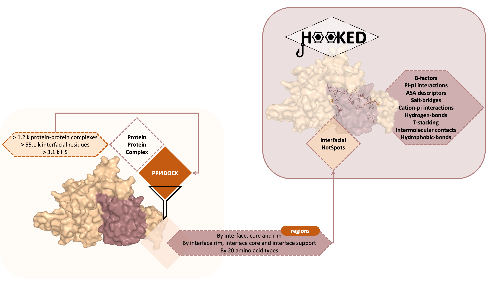

# HOOKED - HOt-spOts KnowlEDge Base

Protein-Protein Interactions (PPIs) dysregulation is highly linked with disease as they constitute the molecular basis for a plethora biological process, which, in turn, makes their understanding a pivotal information for the pharmaceutical industry. Herein, we present HOt-spOts KnowlEDge Base (HOOKED), a comprehensive knowledge database, powered by our predictive tool, SpotOn. This classification algorithm was applied to a non-redundant dataset of 1228 protein-protein complexes to thoroughly analyze PPIs and predict Hot-Spots (HS), interfacial residues whose mutations impact negatively such PPIs. From, 55113 interfacial residues, 3123 were found to be HS. 

In particular, we analyzed and compared amino acids proportion, enrichment and conservation at PPIs along with a comprehensive characterization of motility changes, solvent accessibility, intermonomer structural interactions and any clustered regions in the protein. The amount of data used allowed us to confirm previously considered HS characteristics, but also to provide a robust statistical analysis of bulk PPI interfaces, key to assess their significance for further biological findings. We believe that HOOKED is a forward in the field of in silico analysis applied to biological interactions, and that it provides valuable insights into the structural and physicochemical characteristics of HS in PPIs. 

# Cite US

Nícia Rosário-Ferreira, José G. de Almeida, António J. Preto, Alexandre M.J.J. Bonvin, Irina S. Moreira, ¬¬Hot or not so Hot Spots? Using a data-driven approach to improve the understanding of binding motifs in protein-protein interactions, 2021 - Submitted.

 
